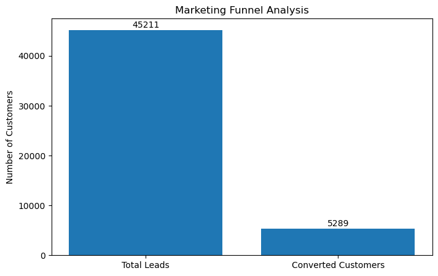
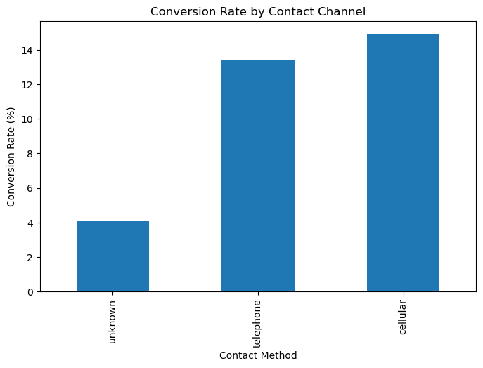
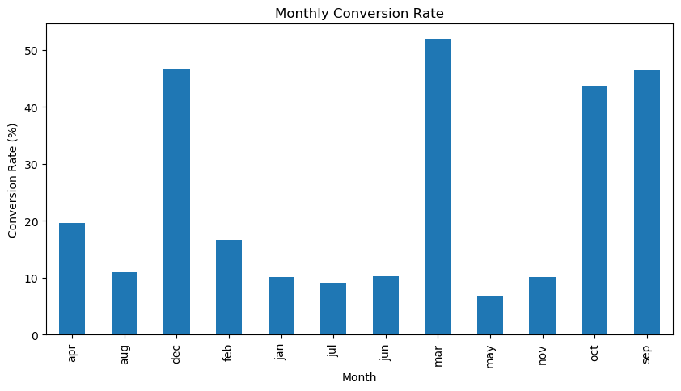
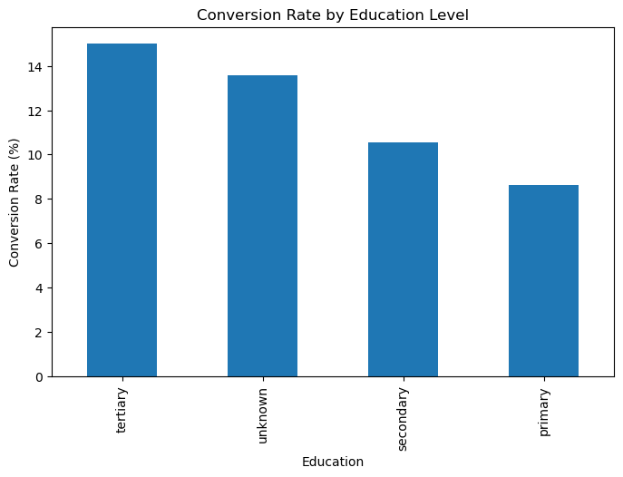
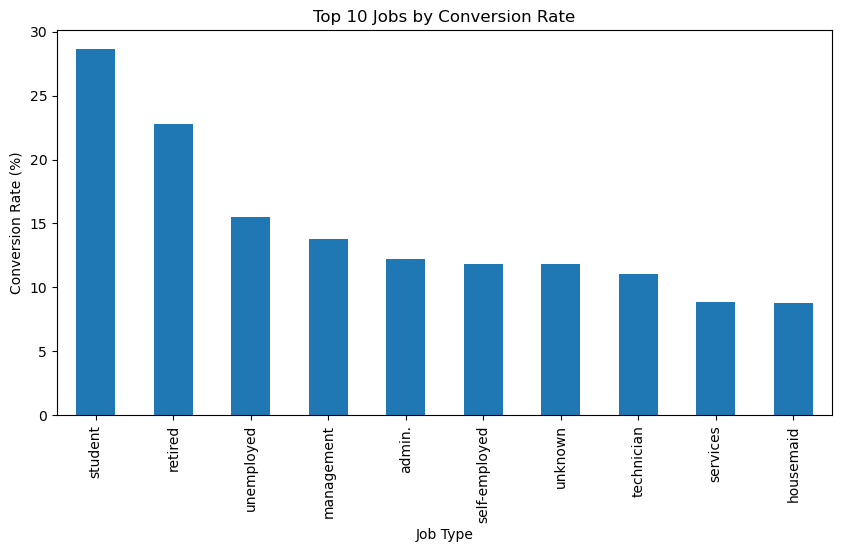
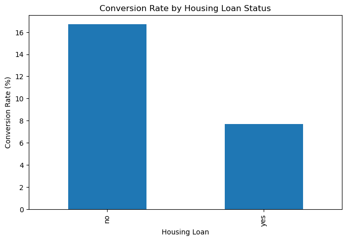
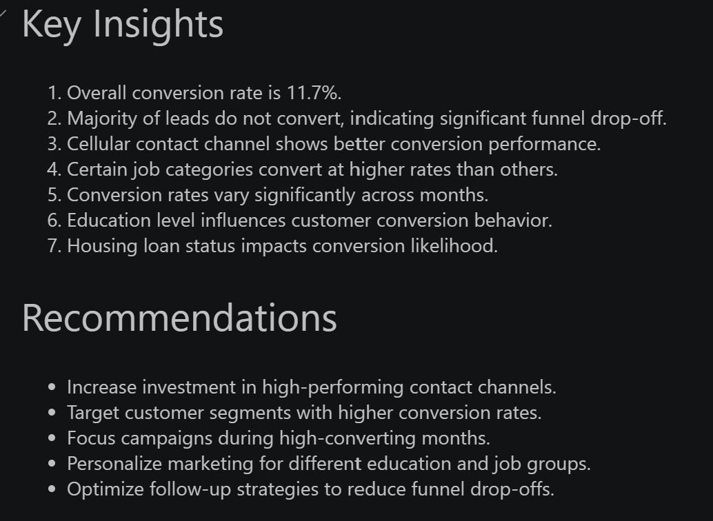

# Marketing Funnel & Conversion Performance Analysis

## Overview

This project analyzes marketing funnel performance using the Bank Marketing Dataset to understand customer conversion behavior, identify funnel drop-offs, evaluate communication channel effectiveness, and generate actionable business recommendations.

The objective is to help organizations optimize marketing strategies, improve conversion rates, and maximize return on marketing investments.

---

## Business Problem

Marketing teams often struggle to identify where potential customers drop out of the conversion funnel and which marketing efforts produce the best results.

This project analyzes customer interactions and campaign outcomes to:

* Identify conversion bottlenecks
* Measure marketing effectiveness
* Discover high-performing customer segments
* Improve lead-to-customer conversion rates

---

## Project Objectives

* Analyze marketing funnel performance
* Measure lead-to-customer conversion rates
* Identify major conversion drop-offs
* Evaluate communication channel effectiveness
* Analyze customer segments and conversion behavior
* Generate business insights and recommendations

---

## Dataset Information

| Attribute       | Value                     |
| --------------- | ------------------------- |
| Dataset         | Bank Marketing Dataset    |
| Total Records   | 45,211                    |
| Features        | 17                        |
| Target Variable | Customer Subscription (y) |

### Key Features

* Age
* Job
* Marital Status
* Education
* Balance
* Housing Loan
* Personal Loan
* Contact Method
* Campaign Information
* Previous Marketing Outcomes

---

## Tools & Technologies

* Python
* Pandas
* NumPy
* Matplotlib
* Jupyter Notebook
* VS Code

---

## Skills Demonstrated

* Marketing Funnel Analysis
* Conversion Rate Optimization
* Customer Segmentation
* Exploratory Data Analysis (EDA)
* Business Intelligence Reporting
* Data Visualization
* Marketing Performance Analysis
* Business Recommendation Generation

---

## Project Structure

```text
Marketing Funnel & Conversion Performance Analysis
│
├── Dashboard
├── dataset
│   ├── bank_marketing.csv
│   └── bank.csv
│
├── notebook
│   └── marketing_funnel_analysis.ipynb
│
├── Report
│   └── marketing_funnel_report.md
│
├── Screenshots
│   ├── funnel_chart.png
│   ├── contact_channel_performance.png
│   ├── monthly_conversion_trend.png
│   ├── education_conversion_analysis.png
│   ├── housing_loan_conversion.png
│   ├── job_conversion_analysis.png
│   └── final_insights.png
│
└── README.md
```

---

## Funnel Performance Metrics

| Metric              | Value  |
| ------------------- | ------ |
| Total Leads         | 45,211 |
| Converted Customers | 5,289  |
| Conversion Rate     | 11.7%  |

---

# Project Visualizations

## Marketing Funnel Analysis



---

## Contact Channel Performance



---

## Monthly Conversion Trend



---

## Education Conversion Analysis



---

## Job Conversion Analysis



---

## Housing Loan Conversion Analysis



---

## Final Insights Dashboard



---

## Analysis Performed

### 1. Funnel Analysis

* Total Leads Analysis
* Converted Customers Analysis
* Conversion Rate Calculation

### 2. Channel Performance Analysis

* Contact Method Evaluation
* Channel-wise Conversion Comparison

### 3. Customer Segmentation Analysis

* Job-wise Conversion Analysis
* Education-wise Conversion Analysis
* Housing Loan Impact Analysis

### 4. Trend Analysis

* Monthly Conversion Performance
* Seasonal Marketing Insights

---

## Key Insights

* Overall conversion rate is **11.7%**.
* A significant drop-off exists between leads and successful conversions.
* Cellular communication channels achieved better conversion performance.
* Customer demographics significantly influence conversion behavior.
* Conversion rates vary across different months, indicating seasonal trends.
* Education level impacts customer subscription decisions.
* Housing loan status affects conversion likelihood.

---

## Business Recommendations

* Increase investment in high-performing communication channels.
* Target customer groups with higher conversion rates.
* Focus marketing campaigns during strong-performing months.
* Personalize customer outreach based on demographic insights.
* Improve lead nurturing strategies to reduce funnel drop-offs.
* Continuously monitor funnel performance using dashboard reporting.

---

## Project Deliverables

* Marketing Funnel Analysis Report
* Customer Conversion Analysis
* Funnel Performance Dashboard
* Customer Segment Insights
* Business Recommendations
* Data Visualizations

---

## Conclusion

This project demonstrates how marketing funnel analysis can be used to identify conversion bottlenecks, evaluate campaign effectiveness, and optimize customer acquisition strategies.

The analysis revealed an overall conversion rate of **11.7%**, highlighting opportunities for marketing optimization through better channel selection, customer segmentation, and campaign targeting.

Organizations can leverage these insights to improve conversion performance and maximize marketing ROI.

---

## Author

### Pothamsetti Venkata Rama Krishna Reddy

B.Tech Computer Science & Engineering (Data Science)

Data Science Intern | DMV CoreTech

Aspiring Data Scientist & Machine Learning Engineer

GitHub: https://github.com/ramakrishnareddy2112

LinkedIn: https://linkedin.com/in/ramakrishnareddy7
